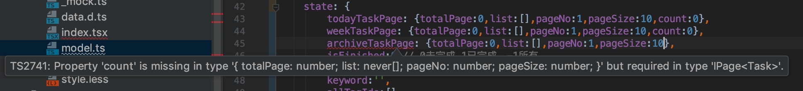
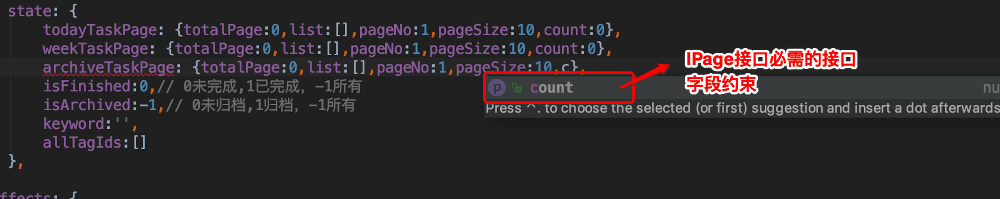
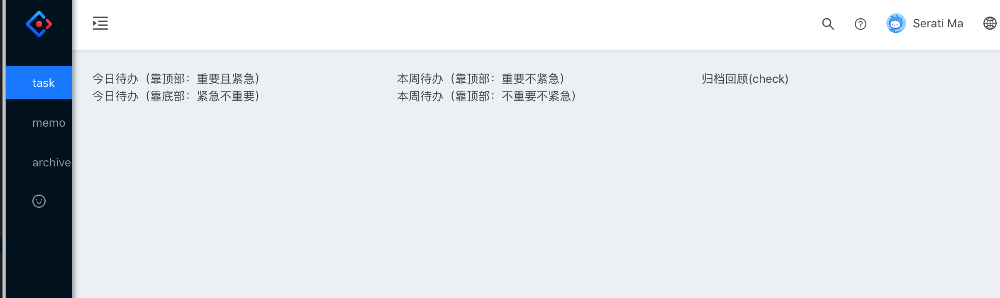
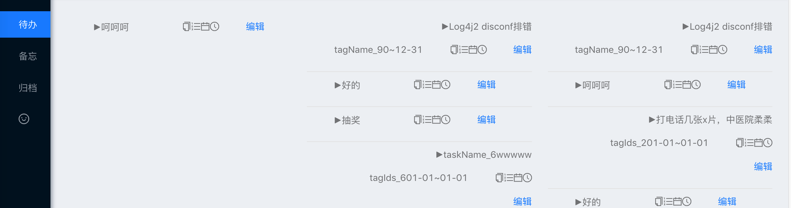
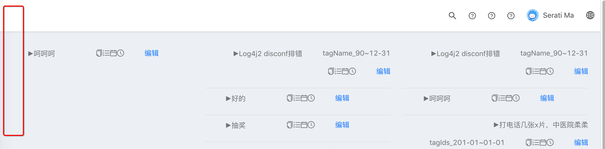
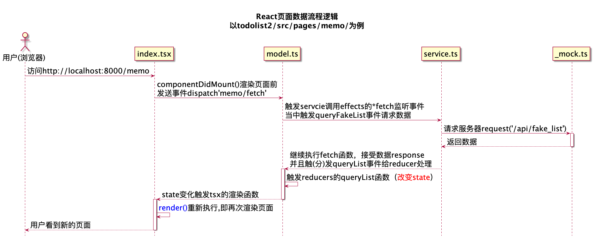
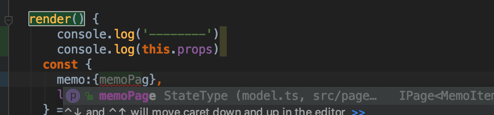

#### 1. 修改菜单权限，让欢迎页，不能登入：

```
/Users/easin/todolist/pc/todolist2/config/config.js
```


#### 2. 登入界面 handleSubmit

```sh
/Users/easin/todolist/pc/todolist2/src/pages/user/login/index.tsx
```


#### 3. 发布userLogin/login 事件

```
#userLogin/*的命名空间在：
/Users/easin/todolist/pc/todolist2/src/pages/user/login/model.ts 
```


#### 4. 登入密码在这里改

```sh
/api/login/account /Users/easin/todolist/pc/todolist2/src/pages/user/login/_mock.ts
```
真实接口需要1.删除mock接口，2.实现真实接口即可

####5.调整login页面布局，使用自定义用户布局，去掉左边侧栏:

参见 [ant design pro 根据不同的场景配置不同的布局，登录页面去除左侧导航栏](http://songqiaolin.com/index/resource/view/id/10.html)

```js
#其实就是配置路由和布局
/Users/easin/todolist/pc/todolist2/config/config.js
#代码如下
 // user
      {
          path: '/user',
          component: '../layouts/UserLayout',
          routes: [
              {
                  name: 'login',
                  path: '/user/login',
                  component: './user/login',
              },

          ],
      },
```


#### 5. 调整basiclayout，修改src/layouts/BasicLayout.jsx

```
#-  collapsed: global.collapsed,
#+  collapsed: true,
export default connect(({ global, settings }) => ({
  collapsed: true,
  settings,
}))(BasicLayout);
```


#### 6. umi-request请求方式默认是json请求，可以改成form

源码解析参见[内部已经实现了defaultInterceptor.js https://zhuanlan.zhihu.com/p/67329059](https://zhuanlan.zhihu.com/p/67329059)

可用参数参见[https://github.com/umijs/umi-request](https://github.com/umijs/umi-request)，比如修改默认jsonbody提交的方式为form，则需要修改requestType:from,例如上面的登入：

```
#/Users/easin/todolist/pc/todolist2/src/pages/user/login/model.ts

export async function fakeAccountLogin(params: FormDataType) {
  return request('/api/user/login', {
    method: 'POST',
    requestType:'form', // 增加这行，修改为表单方式提交 server端就不需要 @RequestBody User user绑定了
    data: params,
  });
}
```
server端：

```java
#调整前@RequestBody 字符串绑定：
@RequestMapping(value = "/login")
public Result login(@RequestHeader(name="Content-Type", defaultValue = "application/json") String contentType,
                        @RequestBody User user)
#调整为表单方式提交后：
@RequestMapping(value = "/login")
public Result login(User user)
```


#### 7. 修改标题：

[怎么修改标题和logo](https://github.com/ant-design/ant-design-pro/issues/3094)

/Users/easin/todolist/pc/todolist2/config/defaultSettings.js,修改title为todolist

以改这个标题；不过还有个问题没解决，就是网页刷新的时候，初始显示依然是Ant Design Pro，刷新后，会变成设置的内容，接下来修改pages/document.ejs,将 title改为 

```html
<title>TODOLIST</title>
```


#### 8. 使用umijs添加task列表模块

```sh
npx umi block add ListBasicList --path=/task
#新增或者修改的文件为：
package.json
config/config.js
src/pages/task/_mock.ts
src/pages/task/data.d.ts
src/pages/task/index.tsx
src/pages/task/model.ts
src/pages/task/service.ts
src/pages/task/style.less
src/pages/task/utils/utils.less
```


#### 9. 使用umijs 添加memo列表模块

```sh
/Users/easin/todolist/pc/todolist2/src/pages/user/login/index.tsx
```
0

#### 10. 准备编写三栏的task:今天、待办和归档

使用ts ，参见：[可能是你需要的 React + TypeScript 50 条规范和经验](https://juejin.im/post/5ce24f8ae51d45106477bd45)

[TypeScript 在 React 中使用总结](https://juejin.im/post/5bab4d59f265da0aec22629b)

[TypeScript 精通指南 电子书](https://nodelover.gitbook.io/typescript/fan-xing)

[类型推断](https://juejin.im/post/5d0cf23af265da1b855c5ef6)

[https://www.runoob.com/typescript/ts-array.html runoob ts教程](https://www.runoob.com/typescript/ts-array.html)

#### 11. 先写一个page泛型接口类约束分页对象：

```sh
/Users/easin/todolist/pc/todolist2/src/pages/user/login/index.tsx
```
1#### 12. 增加我的"待办任务"接口来传输对象

```sh
/Users/easin/todolist/pc/todolist2/src/pages/user/login/index.tsx
```
2

#### 13. 写task模块:

模块页面:jsx页面 ->modal(effects->reducer:改变status)->service(api json请求) 

调用顺序：jsx->modal-effects->service(api)->modal-reducer(更新status)->渲染jsx页面

写一个模块代码上也可以按调用顺序写，也可以按调用顺序反向写，开发时候多半由页面到数据来写，但是这里为了大家理解，我按调用顺序反向写

>大家可以粗暴的死记硬背：jsx页面触发effects事件，effects里的*方法监听事件，并做相应的逻辑处理`(这里通常是网络请求也就是会调用service.ts里的网络请求方法)`，获取需要的数据后，触发reducer事件，reducer事件负责更新state,当state改变时，触发了react渲染机制，即会触发页面的jsx的render()函数，重新渲染页面

#### 14. 先写数据获取service(api):

```sh
/Users/easin/todolist/pc/todolist2/src/pages/user/login/index.tsx
```
3

#### 15. 编辑/Users/easin/todolist/pc/todolist2/src/pages/task/model.ts，添加`获取待办事件` effects和reducers 类型声明(其实就是类型约束，因为ts就是要装逼成强类型语言，无疑给咱们增添了一些固定套路的无聊代码，希望官方后续能ts自动把这些固定代码也给自动推断了，省事了最好)：

```sh
/Users/easin/todolist/pc/todolist2/src/pages/user/login/index.tsx
```
4

#### 16. 页面数据的灵魂state:

设计modal的state的建议:实际是看页面需要怎么展示而来设计state的数据结构的，毕竟ui(jsx)的字段要和数据(state)绑定嘛，这里我想要的待办清单分为三栏，没栏是有下拉加载功能（份额取数），每一栏从上到下，按重要性向下排，越重要月靠上：

今日待办(紧急) | 本周待办(相对紧急) | 归档（回顾check）

-|-|-

1.解决线上bug|1.准备下周会议|1.~~分享todolist~~

2.完成castle接口|2.k8s部署推进|2.~~jdk线程池源码解读~~

.......|......|......

基于这个页面我设计state为：

```sh
/Users/easin/todolist/pc/todolist2/src/pages/user/login/index.tsx
```
5初始化state:

```sh
/Users/easin/todolist/pc/todolist2/src/pages/user/login/index.tsx
```
6如图，如果你少了必须的字段，idea会有如下提示



当你，悬停也会有必需字段的提示，如下，非常方便，这正是因为前面有IPage接口类的申明，这也是强类型的优势，也是typescript发展起来的优势



#### 17. 编写effects的监听事件：*fetchTodayTaskList

```sh
/Users/easin/todolist/pc/todolist2/src/pages/user/login/index.tsx
```
7

#### 18. 编写改变state（页面数据）的reducers事件：appendTaskPage

```sh
/Users/easin/todolist/pc/todolist2/src/pages/user/login/index.tsx
```
8代码如果提示error TS2532: Object is possibly 'undefined'，则要做为空判断：if一下

#### 19. 要google或者百度一个可以用的无限下拉组件，这里选择react-infinite-scroller

```sh
/Users/easin/todolist/pc/todolist2/src/pages/user/login/index.tsx
```
9

20.操刀三栏布局（终于要到页面了）：

为了todolist实用，我们的三栏尽量占尽全部空间,这里看了官方控件布局，选择了GridContent里套Card的比较合适,修改render() 的return函数，代码如下

```
#userLogin/*的命名空间在：
/Users/easin/todolist/pc/todolist2/src/pages/user/login/model.ts 
```
0效果如下：



#### 20. 当然这还是没有渲染数据的，各位看官不要急，慢慢来，因为无限下拉组件react-infinite-scroller需要2个数据源，所以我们先准备这个下拉时触发的2个数据源

一个是初始化，在组件挂载时componentDidMount触发，一个是下拉触发append数据源，在InfiniteScroll组件下拉时触发loadMore()

分别如下：

数据初始化：

```
#userLogin/*的命名空间在：
/Users/easin/todolist/pc/todolist2/src/pages/user/login/model.ts 
```
1下拉触发：

```
#userLogin/*的命名空间在：
/Users/easin/todolist/pc/todolist2/src/pages/user/login/model.ts 
```
2

#### 21. 准备好数据后，正式引入react-infinite-scroller

```
#userLogin/*的命名空间在：
/Users/easin/todolist/pc/todolist2/src/pages/user/login/model.ts 
```
3

出来结果了，但是没有渲染成我们想要的，说明item的渲染是有问题的，仔细一想我们是从脚手架改过来的，当然也应该改改item的渲染

#### 22. 修改item的渲染函数ListContent()，其中引入mement.js报错，打算用ts来实现时间格式化的format

[https://www.runoob.com/typescript/ts-install.html runoob ts教程](https://www.runoob.com/typescript/ts-install.html)

[tsd-提升IDE对JavaScript智能感知的能力](https://www.cnblogs.com/whitewolf/p/tsd-javascript-Intelli-sense.html)

```
#userLogin/*的命名空间在：
/Users/easin/todolist/pc/todolist2/src/pages/user/login/model.ts 
```
4

重新渲染item项：

```
#userLogin/*的命名空间在：
/Users/easin/todolist/pc/todolist2/src/pages/user/login/model.ts 
```
5

#### 23. 复制以上代码2次，分别到第二栏里，到第三栏,把参数变量today换成week,archive，即完成了三栏布局



#### 24. 为了实用，导航尽量顶部，侧边栏干掉：

```
#userLogin/*的命名空间在：
/Users/easin/todolist/pc/todolist2/src/pages/user/login/model.ts 
```
6顺便改掉icon和 多国语言：

```
#userLogin/*的命名空间在：
/Users/easin/todolist/pc/todolist2/src/pages/user/login/model.ts 
```
7

为了todolist更加实用，，我们去掉侧边栏[v4.0 怎么去掉 SiderMenu ，不需要显示 SiderMenu](https://github.com/ant-design/ant-design-pro/issues/4407):

```
#userLogin/*的命名空间在：
/Users/easin/todolist/pc/todolist2/src/pages/user/login/model.ts 
```
8效果如下图：



#### 25. 接着我们要重写footerRender去掉底部版权

```
#userLogin/*的命名空间在：
/Users/easin/todolist/pc/todolist2/src/pages/user/login/model.ts 
```
9

#### 26. 给InfiniteScroll 固定高度，这样可以有滑动条，并且触发下拉事件

```sh
/api/login/account /Users/easin/todolist/pc/todolist2/src/pages/user/login/_mock.ts
```
0

#### 27. 待办清单的列表项，方便修正和调整待办任务

#### 28. 接下来进行我的备忘录

去掉面包屑导航：

去掉

```sh
/api/login/account /Users/easin/todolist/pc/todolist2/src/pages/user/login/_mock.ts
```
1

#### 29. 修改数据类型,对应的数据接口：[http://:8000/api/memo/page?userId=425](http://:8000/api/memo/page?userId=425),这里要使用idea工具重命名类，否则你用手工改的地方比较多，而且很容易会有问题，同时对应的页面/Users/easin/todolist/pc/todolist2/src/pages/memo/index.tsx字段也改改。

```sh
/api/login/account /Users/easin/todolist/pc/todolist2/src/pages/user/login/_mock.ts
```
2数据接口数据：

```sh
/api/login/account /Users/easin/todolist/pc/todolist2/src/pages/user/login/_mock.ts
```
3

#### 30. 编写http,擦掉http mock接口

先理清思路：

///Users/easin/todolist/pc/todolist2/src/pages/memo/index.tsx 的 componentDidMount渲染出页面前获取数据dispatch事件`memo/fetch`,被/Users/easin/todolist/pc/todolist2/src/pages/memo/model.ts 的*fetch（effects事件监听），通过`call(queryFakeList, payload);`去触发/Users/easin/todolist/pc/todolist2/src/pages/memo/service.ts的同步方法queryFakeList，同步方法queryFakeList 去请求后端接口 request('/api/fake_list')，服务器返回数据继续执行effects，并且分发事件给reducer改变state，然后txs监听到state变化重新渲染页面，用户即看到最新的页面了

文件目录：

```sh
/api/login/account /Users/easin/todolist/pc/todolist2/src/pages/user/login/_mock.ts
```
4

流程图如下：



#### 31. 理清楚数据流程后，还是老套路，先准备数据，使用idea重命名queryFakeList 为 queryMemoList，并把api地址指向我们的真实的数据地址，地址改了也等于擦除了mock地址

```sh
/api/login/account /Users/easin/todolist/pc/todolist2/src/pages/user/login/_mock.ts
```
5

#### 32. 因为翻页控件需要知道总页码好渲染分页控件，所以官方示例的state仅仅使用list，是不够的的，还是得使用之前的IPage数据结构:

render()函数里会解构参数，修改结构接受的数据类型list为memoPage,列表数据源也绑定到memoPage.list

```sh
/api/login/account /Users/easin/todolist/pc/todolist2/src/pages/user/login/_mock.ts
```
6render()函数里，还有智能提示，因为用的是ts



#### 33. 条件过滤，做一个条件赛选的，所有|正常|已归档

把脚手架的

```sh
/api/login/account /Users/easin/todolist/pc/todolist2/src/pages/user/login/_mock.ts
```
7改为：

```sh
/api/login/account /Users/easin/todolist/pc/todolist2/src/pages/user/login/_mock.ts
```
8大家看到，我特意加上了一个 onChange事件，在加上之后，借助idea，alt+enter(windows),或者opt+enter(mac),自动帮助生成函数,生成函数后我们log一下看下是否可以获取radio的值，并且分发一个事件给监听器effects的 *toggleArchived

```sh
/api/login/account /Users/easin/todolist/pc/todolist2/src/pages/user/login/_mock.ts
```
9

#### 34. 加上拦截器，请求就有userId了[https://zhuanlan.zhihu.com/p/67329059 原理解读](https://zhuanlan.zhihu.com/p/67329059)

[https://blog.csdn.net/weixin_41753520/article/details/98317567 根据Umi-request开发文档封装请求参数携带头部header](https://blog.csdn.net/weixin_41753520/article/details/98317567)

```js
#其实就是配置路由和布局
/Users/easin/todolist/pc/todolist2/config/config.js
#代码如下
 // user
      {
          path: '/user',
          component: '../layouts/UserLayout',
          routes: [
              {
                  name: 'login',
                  path: '/user/login',
                  component: './user/login',
              },

          ],
      },
```
0对应的登入成功后也要处理

```js
#其实就是配置路由和布局
/Users/easin/todolist/pc/todolist2/config/config.js
#代码如下
 // user
      {
          path: '/user',
          component: '../layouts/UserLayout',
          routes: [
              {
                  name: 'login',
                  path: '/user/login',
                  component: './user/login',
              },

          ],
      },
```
1

#### 35. 处理分页,加上分页事件，看看传参的是什么

```js
#其实就是配置路由和布局
/Users/easin/todolist/pc/todolist2/config/config.js
#代码如下
 // user
      {
          path: '/user',
          component: '../layouts/UserLayout',
          routes: [
              {
                  name: 'login',
                  path: '/user/login',
                  component: './user/login',
              },

          ],
      },
```
2点击分页后，发现控制台打印：

```js
#其实就是配置路由和布局
/Users/easin/todolist/pc/todolist2/config/config.js
#代码如下
 // user
      {
          path: '/user',
          component: '../layouts/UserLayout',
          routes: [
              {
                  name: 'login',
                  path: '/user/login',
                  component: './user/login',
              },

          ],
      },
```
3那接着改造，分发分页事件

```js
#其实就是配置路由和布局
/Users/easin/todolist/pc/todolist2/config/config.js
#代码如下
 // user
      {
          path: '/user',
          component: '../layouts/UserLayout',
          routes: [
              {
                  name: 'login',
                  path: '/user/login',
                  component: './user/login',
              },

          ],
      },
```
4

#### 36. 加入关键字搜索事件：

```js
#其实就是配置路由和布局
/Users/easin/todolist/pc/todolist2/config/config.js
#代码如下
 // user
      {
          path: '/user',
          component: '../layouts/UserLayout',
          routes: [
              {
                  name: 'login',
                  path: '/user/login',
                  component: './user/login',
              },

          ],
      },
```
5使用idea生成函数:

```js
#其实就是配置路由和布局
/Users/easin/todolist/pc/todolist2/config/config.js
#代码如下
 // user
      {
          path: '/user',
          component: '../layouts/UserLayout',
          routes: [
              {
                  name: 'login',
                  path: '/user/login',
                  component: './user/login',
              },

          ],
      },
```
6测试输入xxxx,调试控制台确实有了：

```js
#其实就是配置路由和布局
/Users/easin/todolist/pc/todolist2/config/config.js
#代码如下
 // user
      {
          path: '/user',
          component: '../layouts/UserLayout',
          routes: [
              {
                  name: 'login',
                  path: '/user/login',
                  component: './user/login',
              },

          ],
      },
```
7分发搜索事件：

```js
#其实就是配置路由和布局
/Users/easin/todolist/pc/todolist2/config/config.js
#代码如下
 // user
      {
          path: '/user',
          component: '../layouts/UserLayout',
          routes: [
              {
                  name: 'login',
                  path: '/user/login',
                  component: './user/login',
              },

          ],
      },
```
8

#### 37. a标签换成Link，可以缓存页面不用每次刷新[https://pro.ant.design/docs/router-and-nav-cn](https://pro.ant.design/docs/router-and-nav-cn)，总结一句

router标签是配置，link是使用

```js
#其实就是配置路由和布局
/Users/easin/todolist/pc/todolist2/config/config.js
#代码如下
 // user
      {
          path: '/user',
          component: '../layouts/UserLayout',
          routes: [
              {
                  name: 'login',
                  path: '/user/login',
                  component: './user/login',
              },

          ],
      },
```
9

50.不同页面（组件之间通信），这里要完成顶部搜索框和添加功能，但是弹出框又在task/index.tsx里，这个时候，有两种解决方案：

方案一：原生react dva模型使用 state,加一个字段存储标记符addBtnFlag，类似消息标记符解决，但是这里有两点注意：

1)不能使用componentDidMount，因为这个只是渲染一次，state变化时候，在页面不会再渲染了

2)不能放到render()，因为会无限循环报错

3)只能放在componentDidUpdate(prevProps, prevState) 处理

4)一定要加判断，否则又会死循环了，具体代码如下：

```
#-  collapsed: global.collapsed,
#+  collapsed: true,
export default connect(({ global, settings }) => ({
  collapsed: true,
  settings,
}))(BasicLayout);
```
05)对话框关闭时候，也要重置这个标记符，方便顶部导航添加按钮再次使用：

```
#-  collapsed: global.collapsed,
#+  collapsed: true,
export default connect(({ global, settings }) => ({
  collapsed: true,
  settings,
}))(BasicLayout);
```
16)那么顶部导航触发按钮：

```
#-  collapsed: global.collapsed,
#+  collapsed: true,
export default connect(({ global, settings }) => ({
  collapsed: true,
  settings,
}))(BasicLayout);
```
2组件生命周期参见：

[https://juejin.im/entry/587de1b32f301e0057a28897正确掌握 React 生命周期 (Lifecycle)](https://juejin.im/entry/587de1b32f301e0057a28897)

反正一句话：实时监听state变化反复触发，渲染，就使用：componentDidUpdate，初始化渲染（就一次，通常用来加载数据）就使用：componentDidMount

方案二：使用事件监听机制：

[react 组件远距离通信 EventEmitter cdn.bootcss.com/EventEmitter/5.2.6/EventEmitter](https://blog.csdn.net/Cribug8080/article/details/89228032)

[react 中 EventEmitter 事件总线机制](http://www.bubuko.com/infodetail-3104789.html)

[https://juejin.im/post/5ab9aeeaf265da23830ae61eReact 组件间通讯](https://juejin.im/post/5ab9aeeaf265da23830ae61e)

#### 38. 构建：

```
#-  collapsed: global.collapsed,
#+  collapsed: true,
export default connect(({ global, settings }) => ({
  collapsed: true,
  settings,
}))(BasicLayout);
```
3根目录下有全局模拟数据的总文件夹`mock`：/Users/easin/todolist/pc/todolist2/mock/

```sh

///Users/easin/todolist/pc/todolist2/mock

├── notices.js

├── route.js

└── user.js

```